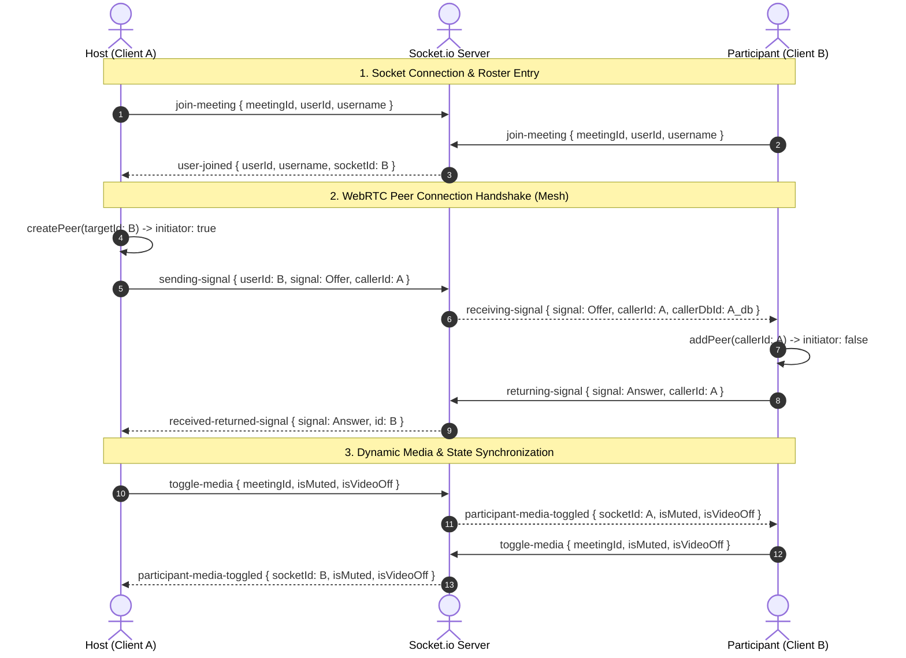

# 🎥 IntellMeet - Premium AI-Powered Video Conferencing & Collaboration Hub

> A state-of-the-art, high-fidelity collaborative meeting platform featuring real-time WebRTC multi-user video/audio, dynamic screen-sharing with camera-off fallbacks, shared notes, team tasks, file-sharing, and AI-powered automated meeting transcription & summaries.

---

## ✨ Features & Capabilities

### 📡 High-Fidelity WebRTC Mesh Audio & Video
*   **Decentralized Multi-User Mesh Architecture**: Powering instant peer-to-peer audio and video transmission with ultra-low latency via `simple-peer`.
*   **Privacy-by-Default Controls**: Microphone and camera tracks automatically join muted/camera-off by default, protecting user privacy in every session.
*   **Smart Screen Sharing**: Instant, high-resolution screen-sharing with dynamic, smooth track replacement (`replaceTrack`) that works perfectly in both camera-enabled and camera-disabled environments.
*   **Device-Safe Fallbacks**: Multi-tier `getUserMedia` fallbacks and mobile-ready display media controls to support tablets, smartphones, and low-end devices flawlessly.
*   **Real-time Media Badges**: Beautiful floating state overlays (`🔇 MUTED`, `Camera Disabled`) on active grid cards to ensure instant room awareness.

### 🤖 Intelligent AI Assistance
*   **Live Transcription**: Real-time meeting audio speech capture and text translation.
*   **AI Summary Engine**: High-performance NLP generation producing instant executive summaries, decision trackers, and tags.
*   **Auto-Task Extraction**: Automated tracking of action items and assignments directly from meeting transcripts.

### 🤝 Multi-User Collaboration Board
*   **Dynamic Chat**: Glassmorphic instant-message sidebar featuring typing indicators and dynamic chat overlays.
*   **Collaborative Real-time Notes**: Shared rich-text note pad synchronized across all room attendees using fast Socket relays.
*   **Actionable Task Board**: Add, assign, and track completion progress of actionable tasks during the call.
*   **Secure File-Sharing**: Seamless document, asset, and image sharing directly within the dashboard.

### 📊 Historical Analytics & Recovery
*   **Session Archive**: Interactive meeting history table listing participant rosters, duration, and completion details.
*   **Locked Recording Playbacks**: Smart UI recording states that conditionally display video players if a meeting session was recorded, or disable them with professional placeholders if not.
*   **Secure Key Recovery**: Complete password reset mechanism utilizing secure, customizable database-backed security questions (e.g. *What is your mother's name?*) and trimmed verification layers.

---

## 🛠️ Complete Tech Stack

| Component | Technology | Description |
| :--- | :--- | :--- |
| **Frontend Core** | React 18 + Vite | Rapid bundling, fast-refresh HMR, component isolation, and optimized builds. |
| **Styling & UX** | Glassmorphism & Custom CSS | Custom CSS variables, linear gradients, dynamic keyframe glow animations, and responsive layout grids. |
| **Backend API** | Node.js + Express.js | High-performance, scalable asynchronous event-driven RESTful architecture. |
| **Real-time Engine** | Socket.io v4 | Dual-channel WebSockets signaling, roster updates, chat, tasks, and notes sync. |
| **WebRTC Mesh** | Simple-Peer | Lightweight wrapper for WebRTC peer connection, offer/answer exchange, and ICE handshakes. |
| **Database** | MongoDB + Mongoose | Document-based schema design with pre-save encryption, validator hooks, and relational models. |
| **Asset Storage** | Cloudinary API | Secure cloud storage for meeting recordings, profile pictures, and uploaded files. |

---

## 📂 Project Architecture & Directory Tree

```
IntellMeet/
├── client/                     # Frontend Application (React + Vite)
│   ├── src/
│   │   ├── components/
│   │   │   ├── auth/           # LoginForm.jsx, RegisterForm.jsx
│   │   │   ├── dashboard/      # MeetingHistoryTable.jsx, Workspace/
│   │   │   └── meeting/        # VideoPlayer.jsx, ParticipantList.jsx, MeetingControls.jsx
│   │   ├── hooks/              # useAuth.js, useSocket.js
│   │   ├── pages/
│   │   │   ├── Auth/           # Login & Register views
│   │   │   ├── Dashboard/      # Main meeting history dashboard
│   │   │   ├── MeetingDetails/ # History summaries & recording playback details
│   │   │   └── MeetingRoom/    # Real-time room, CollaborationDashboard, MeetingAI
│   │   ├── main.jsx            # React root mount entry
│   │   └── index.css           # Premium global CSS variables & glassmorphic system
│   ├── package.json
│   └── vite.config.js
├── server/                     # Backend API & Socket Server
│   ├── src/
│   │   ├── config/             # db.js, socket.js (Socket.io room events)
│   │   ├── controllers/        # authController.js, meetingController.js
│   │   ├── models/             # User.js, Meeting.js, Chat.js, Task.js
│   │   ├── routes/             # authRoutes.js, meetingRoutes.js
│   │   ├── services/           # chatService.js, noteService.js, taskService.js
│   │   └── server.js           # Server boot entry point
│   ├── package.json
│   └── .env.example
├── .gitignore                  # Master file exclusion rules
├── README.md                   # Complete developer documentation
└── render.yaml                 # Render Infrastructure-as-Code service deployment
```

---

## 🏗️ System Flow & WebRTC Signaling Topology



---

## ⚡ Setup & Installation

### Prerequisites
*   **Node.js**: v18.0.0 or higher
*   **MongoDB**: Local MongoDB community server or MongoDB Atlas Cluster URI
*   **NPM**: v9.0.0 or higher

---

### Step 1: Environment Configuration

In the `/server` directory, duplicate the `.env.example` file to `.env` and fill out the configuration keys:

```ini
# Server Details
PORT=5000
NODE_ENV=development

# Database URIs
MONGODB_URI=mongodb+srv://<username>:<password>@cluster.mongodb.net/intellmeet

# Security Token Secret
JWT_SECRET=super_secure_jwt_secret_token_123!

# Client App URL (For CORS policies)
CLIENT_URL=http://localhost:5173

# Optional: Cloudinary Storage keys for meeting recordings/uploads
CLOUDINARY_CLOUD_NAME=your_cloudinary_name
CLOUDINARY_API_KEY=your_api_key
CLOUDINARY_API_SECRET=your_api_secret

# Optional: HuggingFace API key for meeting summary transcriptions
HUGGINGFACE_API_KEY=your_hugging_face_token
```

---

### Step 2: Running the Server Backend

Navigate to `/server`, install the packages, and run the server in development mode:

```bash
cd server
npm install
npm run dev
```

The backend server will spin up on **`http://localhost:5000`** with real-time socket events enabled.

---

### Step 3: Running the Client Frontend

Navigate to `/client`, install dependencies, and run the Vite dev server:

```bash
cd client
npm install
npm run dev
```

The frontend application will spin up on **`http://localhost:5173`** featuring Hot Module Replacement (HMR).

---

## 🚢 Production Deployment

### Option A: Serve Frontend static bundle directly from the Express server
This is the easiest single-web-service model to deploy on platforms like Render or Heroku.

1. Build the frontend client static bundle:
    ```bash
    cd client
    npm run build
    ```
    This generates a `/client/dist` directory containing highly optimized production assets.
2. Boot up the backend node server:
    ```bash
    cd ../server
    npm start
    ```
    The server will automatically detect the static directory and host the frontend on port `5000`.

---

### Option B: Infrastructure-as-Code Deployment on Render (Automatic Setup)
IntellMeet includes a pre-configured `render.yaml` template file. To provision separate frontend and backend environments automatically:

1. Push your project to a remote **GitHub** repository.
2. Log into your **Render** dashboard.
3. Select **Blueprints** from the top menu, then click **New Blueprint Instance**.
4. Link your Github repository. Render will automatically read `render.yaml` and configure:
    *   An Express Backend **Web Service**.
    *   A React Frontend **Static Site** mapped directly to the backend API.
5. Provide your environment variables (`MONGODB_URI`, `JWT_SECRET`) in the Render settings panel to complete deployment!

---

## 🔒 Security Question & Password Recovery Flow

For user accounts to utilize the forgot password recovery flow, a security question validator is fully integrated into the database schema (`User.js`):
1.  **Selection**: During user registration, the user enters a recovery question (e.g. *What is your mother's name?*) and its answer.
2.  **Verification**: If the user clicks `Forgot Password? Key Recovery` on the Login view, they insert their email. The server fetches their registered question.
3.  **Reset**: Providing the correct answer (case-insensitive and trimmed) permits the user to instantly update and overwrite their password securely.

---

## 📜 License
This project is licensed under the **MIT License**.